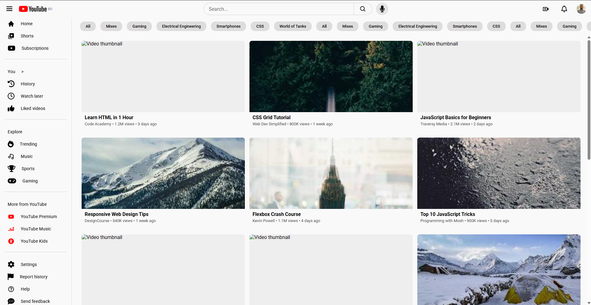

# YouTube Frontend Clone

A responsive YouTube homepage clone built purely with **HTML, CSS, and JavaScript**. This project is created for learning and practice purposes, focusing on **frontend development**, layout structuring, and responsive design. No backend or database is used.

**[Live Demo]([https://youtube-clone-six-self.vercel.app/)**

## Project Overview

This project replicates the layout and feel of YouTube's homepage, including:

- A sticky **top navbar** with search, upload, notification, and user profile icons.
- A **collapsible sidebar** with navigation links, sections, and settings.
- A **scrollable video feed** with realistic video cards.
- A **suggestion bar** for categories and filters.
- Fully **responsive design** for desktops, tablets, and mobile screens.

This project is ideal for **understanding frontend architecture**, responsive layouts, and interactive UI components.

## Technologies Used

- **HTML5** – Structure and semantic layout.
- **CSS3** – Styling, responsive layouts, flexbox, grid, and animations.
- **JavaScript** – Sidebar toggling, dropdowns, and interactivity.
- **Boxicons & Font Awesome** – For icons.
- **Google Fonts** – For typography.

## Features

- **Responsive Navbar**: Hamburger menu for smaller screens, icons for quick actions.
- **Collapsible Sidebar**: Shrinkable sidebar, automatically adjusting the main content.
- **Scrollable Video Feed**: Video cards with thumbnail, title, channel, views, and timestamp.
- **Suggestion Bar**: Horizontally scrollable filter categories like YouTube.
- **Hover Effects**: Buttons, sidebar items, and cards respond visually on hover.
- **Mobile-First Design**: Sidebar hidden on small screens, accessible via menu icon.

